### This file defines a Mermaid-based interactive flowchart that visualizes the content architecture, build process, and deployment pipeline of the HAPI FHIR Tutorial Repository. 

-  Navigate the content modules easily via this diagram.
-  Understand how each piece contributes to the final documentation site.

```mermaid
flowchart TD
    subgraph "Content Modules"
        subgraph "CRUD Module" 
            CRUD_Lesson["lesson.md"]:::content
            CRUD_Images["img/"]:::content
        end
        subgraph "FHIRPath Module"
            FHIRPath_Lesson["lesson.md"]:::content
        end
        subgraph "Profiling Module"
            Profiling_Lesson["lesson.md"]:::content
            Profiling_Images["images/"]:::content
            Profiling_Examples["profile_examples/"]:::content
        end
        subgraph "SearchParameter Module"
            SP_Lesson["lesson.md"]:::content
            SP_Images["images/"]:::content
        end
        subgraph "Search References/ChainHasIncludeRevinclude Module"
            SRC_Lesson["lesson.md"]:::content
            SRC_Images["images/"]:::content
        end
        subgraph "Terminology Module"
            Term_Lesson["lesson.md"]:::content
            Term_Images["img/"]:::content
        end
        subgraph "Transactions Module"
            Trans_Lesson["lesson.md"]:::content
            Trans_Images["img/"]:::content
        end
        subgraph "Examples"
            Examples_JSON["examples/"]:::content
            Examples_Sub["examples/Search_References_ChainHasIncludeRevinclude/"]:::content
        end
        README["README.md"]:::content
        Gitignore[".gitignore"]:::content
    end

    subgraph "CI/CD Pipeline"
        GitHubActions["GitHub Actions"]:::pipeline
    end

    DocumentationProcessor["Documentation Processor (SSG)"]:::pipeline
    Hosting["GitHub Pages / CDN"]:::hosting
    Browser["Learner Browser"]:::external
    ExternalRef["Smile CDR & CC License"]:::external
    GitHubRepo["GitHub Repository"]:::external

    %% Connections
    GitHubRepo -->|"push"| GitHubActions
    GitHubActions -->|"build"| DocumentationProcessor
    CRUD_Lesson -->|"input"| DocumentationProcessor
    CRUD_Images -->|"assets"| DocumentationProcessor
    FHIRPath_Lesson -->|"input"| DocumentationProcessor
    Profiling_Lesson -->|"input"| DocumentationProcessor
    Profiling_Images -->|"assets"| DocumentationProcessor
    Profiling_Examples -->|"assets"| DocumentationProcessor
    SP_Lesson -->|"input"| DocumentationProcessor
    SP_Images -->|"assets"| DocumentationProcessor
    SRC_Lesson -->|"input"| DocumentationProcessor
    SRC_Images -->|"assets"| DocumentationProcessor
    Term_Lesson -->|"input"| DocumentationProcessor
    Term_Images -->|"assets"| DocumentationProcessor
    Trans_Lesson -->|"input"| DocumentationProcessor
    Trans_Images -->|"assets"| DocumentationProcessor
    Examples_JSON -->|"input"| DocumentationProcessor
    Examples_Sub -->|"input"| DocumentationProcessor
    README -->|"docs info"| DocumentationProcessor
    Gitignore -->|"config"| DocumentationProcessor

    DocumentationProcessor -->|"deploy"| Hosting
    Hosting -->|"serve"| Browser
    ExternalRef -.->|"reference"| DocumentationProcessor

    %% Click Events
    click CRUD_Lesson "https://github.com/hapifhir/fhir-tutorial/blob/master/CRUD operations/lesson.md"
    click CRUD_Images "https://github.com/hapifhir/fhir-tutorial/tree/master/CRUD operations/img/"
    click FHIRPath_Lesson "https://github.com/hapifhir/fhir-tutorial/blob/master/FHIRPath/lesson.md"
    click Profiling_Lesson "https://github.com/hapifhir/fhir-tutorial/blob/master/Profiling/lesson.md"
    click Profiling_Images "https://github.com/hapifhir/fhir-tutorial/tree/master/Profiling/images/"
    click Profiling_Examples "https://github.com/hapifhir/fhir-tutorial/tree/master/Profiling/profile_examples/"
    click SP_Lesson "https://github.com/hapifhir/fhir-tutorial/blob/master/SearchParameter/lesson.md"
    click SP_Images "https://github.com/hapifhir/fhir-tutorial/tree/master/SearchParameter/images/"
    click SRC_Lesson "https://github.com/hapifhir/fhir-tutorial/blob/master/Search_References_ChainHasIncludeRevinclude/lesson.md"
    click SRC_Images "https://github.com/hapifhir/fhir-tutorial/tree/master/Search_References_ChainHasIncludeRevinclude/images/"
    click Term_Lesson "https://github.com/hapifhir/fhir-tutorial/blob/master/Terminology/CodeSystem_and_ValueSet/lesson.md"
    click Term_Images "https://github.com/hapifhir/fhir-tutorial/tree/master/Terminology/CodeSystem_and_ValueSet/img/"
    click Trans_Lesson "https://github.com/hapifhir/fhir-tutorial/blob/master/Transactions/lesson.md"
    click Trans_Images "https://github.com/hapifhir/fhir-tutorial/tree/master/Transactions/img/"
    click Examples_JSON "https://github.com/hapifhir/fhir-tutorial/tree/master/examples/"
    click Examples_Sub "https://github.com/hapifhir/fhir-tutorial/tree/master/examples/Search_References_ChainHasIncludeRevinclude/"
    click README "https://github.com/hapifhir/fhir-tutorial/blob/master/README.md"
    click Gitignore "https://github.com/hapifhir/fhir-tutorial/blob/master/.gitignore"

    %% Styles
    classDef content fill:#CFFFB3,stroke:#2E8B57,stroke-width:1px
    classDef pipeline fill:#B3E5FC,stroke:#0288D1,stroke-width:1px
    classDef hosting fill:#FFE082,stroke:#FFA000,stroke-width:1px
    classDef external fill:#F8BBD0,stroke:#C2185B,stroke-width:1px
```

